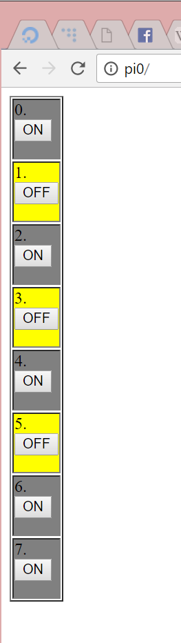

# rpinserver
Ultra simple webserver for accessing Raspberry Pi GPIO pins.
It's not extra neat. It could have been done better. It could avoid using html tables. But hey, it's just a simple tool written in one evening.

## Installation
If you want to start this server autmatically on your rpi boot, put following line in `/etc/rc.local`:
```
su - pi -c "screen -dm -S rpinserver sudo python3 /home/pi/rpinserver/server.py"
```
(assuming you've cloned this project in `/home/pi`). After starting it turns sequentionally every output for 0.1s so user can see it has booted.

## Configuration

Pins to controll are defined at the beginning of the fie:
```
PINS = [25, 8, 7, 1, 6, 13, 19, 26]
```
Adjust this array to suit your needs. Pins are indexed by indexes in this array - at index 0 is GPIO25, at index 1 is GPIO8 etc.
All pins are set as output pins.

## Usage

### Web UI

Just navigte to http://your-pi. You should see ugly '90s style html table representing state of the pins with buttons to change them:



### API

#### Getting state of pin
##### Address (GET):
```
/[index]
```
##### Output:
- `0` for turned off
- `1` for turned on

##### Example:
```
# get state of first gpio
someone@somewhere:~ $ curl your-pi/0
1
```

#### Setting state of pin
##### Address (POST):
```
/<index>
```
#### Data:
`state=<value>`, where `<value>` is `0` or `1`.

##### Example:
```
# turn on second gpio
someone@somewhere:~ $ curl -d state=1 your-pi/1
```

#### Setting state of multiple pins
##### Address (POST):
```
/
```
#### Data:
`<index>=<value>[&<index>=<value>]*`, where `<value>` is `0` or `1`.

##### Example:
```
# turn on first and third gpio, turn off fourth gpio, don't change other gpios
someone@somewhere:~ $ curl -d "0=1&2=1&3=0" your-pi
```
